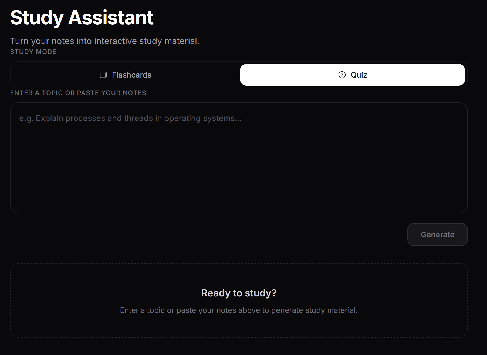
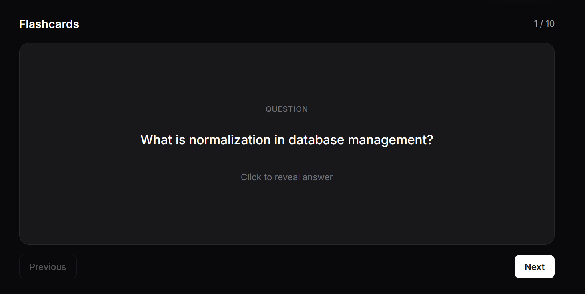
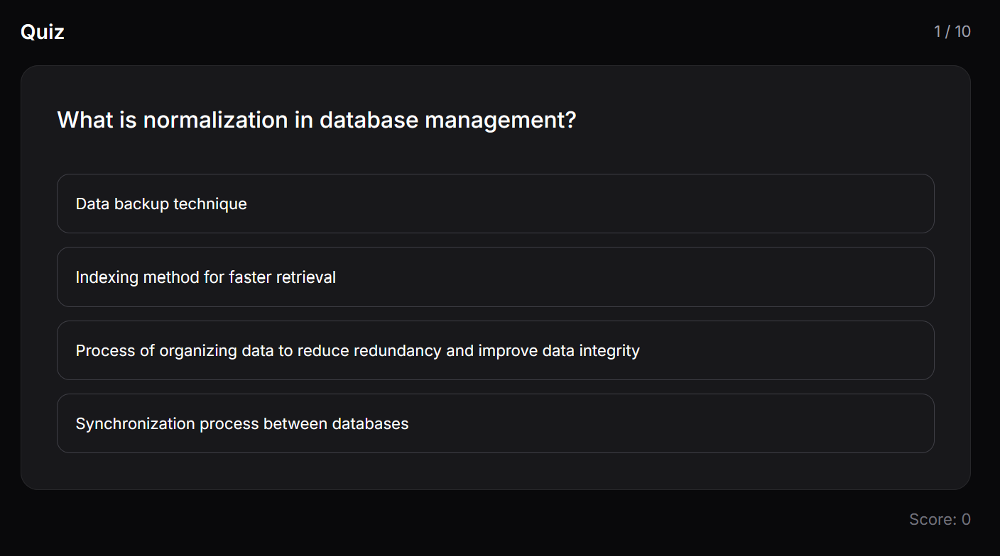

<div align="center">

# Study Assistant

**Turn any topic or set of notes into flashcards and a quiz — powered by a local LLM.**

[](https://react.dev)
[](https://vite.dev)
[](https://expressjs.com)
[](https://zod.dev)
[](https://ollama.com)
[](LICENSE)

</div>

Study Assistant turns a topic or a set of notes into 10 study cards that you can use as flashcards or as a multiple-choice quiz. It is not a chatbot. A local LLM (Qwen2.5 through Ollama) returns structured JSON, the app validates it with Zod, and only validated data is shown as interactive flashcards and quiz questions.

### Preview

<div align="center">



</div>

<table>
  <tr>
    <td align="center">
      
      <br /><sub><b>Flashcards</b> — click to flip, step through all 10</sub>
    </td>
    <td align="center">
      
      <br /><sub><b>Quiz</b> — four shuffled options, instant feedback</sub>
    </td>
  </tr>
</table>

---

## Why Study Assistant

- **Runs fully local** — Qwen2.5 via Ollama; no API key, no data leaves your machine.
- **One AI call, two views** — a single generation powers both flashcards and the quiz, so they can never disagree on the answer.
- **LLM output treated as untrusted** — Zod validates shape *and* content on the backend, then again on the frontend.
- **Fair quizzes** — options are shuffled client-side with Fisher–Yates, so the correct answer's position is random.
- **Learn from mistakes** — retest only the questions you got wrong, without a new model call.

---

## Requirements

- Node.js 20.19+ or 22.12+ (Vite requires one of these)
- [Ollama](https://ollama.com/download)

## Setup

The project runs as three separate processes: Ollama, the backend, and the frontend. Give each one its own terminal and start them in the order below.

### 1. Ollama (terminal 1)

```bash
ollama pull qwen2.5
ollama serve
```

`ollama serve` starts the API at `http://localhost:11434`. If the Ollama desktop app is already running, the server is already up. Skip `ollama serve` in that case, or it will fail with "address already in use".

To check that the model is available, run:

```bash
ollama list
```

### 2. Backend (terminal 2)

```bash
cd backend
npm install
cp .env.example .env
```

Edit `backend/.env`:

```env
PORT=3000
MODEL_URL=http://localhost:11434/api/generate
MODEL_NAME=qwen2.5
RESPONSE_TIMEOUT_MS=90000
```

Start the backend:

```bash
npm run dev
```

It runs at `http://localhost:3000`. `GET /health` returns `{"status":"ok"}`.

### 3. Frontend (terminal 3)

```bash
cd frontend
npm install
cp .env.example .env
```

Edit `frontend/.env`:

```env
VITE_BASE_URL=http://localhost:3000/api
```

Start the frontend:

```bash
npm run dev
```

Open the URL that Vite prints (by default `http://localhost:5173`).

> On Windows PowerShell, use `Copy-Item .env.example .env` instead of `cp`.

---

## Usage

1. Paste a topic (for example, "Operating system process scheduling") or your own notes into the input box.
2. Click generate. A local model can take anywhere from several seconds to about a minute.
3. In **Flashcards** mode, click a card to flip between question and answer, and use Previous and Next to move through the set.
4. Switch to **Quiz** mode to answer the same 10 cards as multiple-choice questions. Each question has four options: the correct answer and three distractors. You get immediate feedback after each answer and a score at the end.
5. If you missed any questions, click **Retest wrong answers** to go through only those cards again.

If generation fails (timeout, model unavailable, invalid output), an error message appears with a retry button. Retry resubmits the same input.

---

## Architecture

```text
React (Vite)  ──POST /api/study/generate──▶  Express  ──POST /api/generate──▶  Ollama (qwen2.5)
     ▲                                          │
     └──────────── validated JSON ◀── Zod ◀─────┘
```

### Shared card data

Each card is generated once as `{ id, question, answer, distractors[3] }`. Flashcards use `question` and `answer`; the quiz uses the same fields plus `distractors`. Switching modes re-renders the same validated data, so both views always show the same questions and answers.

### Backend proxy

The browser never talks to the model directly. The model URL, the model name, and the timeout are set only in the backend's environment, and the prompt is built on the server. The client sends only the user's input and receives validated data. Ollama runs locally without an API key, so there is currently no secret to hide. If the app moved to a hosted model, the provider's API key would be kept in the backend `.env` and would never be sent to the browser.

The backend also converts failures into clear HTTP errors that the frontend can map to user-facing messages:

| Status | Meaning |
|---|---|
| `400` | Empty input |
| `502` | Model unreachable, empty response, invalid JSON, or data that fails the schema |
| `504` | Timeout |

### Zod validation

LLM output is untrusted input. The model can return malformed JSON, missing fields, the wrong number of items, or data with the right shape but broken content. [backend/src/schemas/study.schema.ts](backend/src/schemas/study.schema.ts) checks both:

- **Shape:** exactly 10 cards, and every field is a non-empty string.
- **Exactly 3 distractors:** `distractors` is a 3-tuple, not an open-ended array.
- **No duplicate options within a card:** the answer and all three distractors must differ from each other (case-insensitive), so a quiz question never has two identical choices or a distractor that repeats the answer.
- **No duplicate card IDs:** IDs are used as React keys and to track wrong answers for retest, so they must be unique.
- **No duplicate questions:** case-insensitive.

The frontend runs a second Zod parse on the API response ([frontend/src/lib/validateResult.ts](frontend/src/lib/validateResult.ts)). This way the UI gets its types from a runtime check rather than an unchecked type cast.

### Client-side option shuffling

The model returns the correct answer in its own `answer` field, separate from `distractors`. If the options were shown in the order the model returned them, the correct answer would always be in the same position. Asking the model to randomize the order isn't reliable, and it would mean giving up the clear answer/distractor split. Instead, the quiz combines `answer` and `distractors` and shuffles them in the browser with a Fisher–Yates shuffle ([frontend/src/lib/shuffle.ts](frontend/src/lib/shuffle.ts)). The shuffle is memoized per card, so the options stay in place while you answer. The data stays simple, and the correct answer's position is random for each question.

### Stale-response guard

[frontend/src/App.tsx](frontend/src/App.tsx) keeps a request counter in a `useRef`. Each call to `handleGenerate` increments it and records its own ID. When a response or error comes back, it is applied only if its ID still matches the current counter. The loading flag is cleared only by the latest request. If a slow earlier request finishes after a newer one has started (for example, after a retry), its result is discarded instead of overwriting newer state.

### Retest wrong answers

During a quiz, [frontend/src/components/QuizView.tsx](frontend/src/components/QuizView.tsx) records the `id` of each card you answer incorrectly. "Retest wrong answers" filters the original card set to those IDs and restarts the quiz with just that subset. It does not make a second AI call. You are retested on the exact questions you missed, and a new generation can't replace them with different ones.

---

## AI Usage Note

I used Claude as a design and review partner for three parts of this project:

- **UI and styling.** Claude helped with the Tailwind CSS v4 styling: the dark theme, the Inter and Instrument Serif font pairing set in `@theme` ([frontend/src/index.css](frontend/src/index.css)), responsive `sm:` breakpoints, hover and state transitions, and the loading spinner. It also helped lay out the components for the flashcard, quiz, empty, loading, and error states.
- **The structured-output prompt.** Claude helped draft and refine the prompt in [backend/src/utils/generateStudyPrompt.ts](backend/src/utils/generateStudyPrompt.ts). That includes the JSON-only instructions, the exact output shape, the rules for plausible and clearly wrong distractors of similar length, and the later fix that tells the model to avoid "which of the following"-style questions, which read badly on a flashcard.
- **Documentation.** Claude helped structure and polish this README: the setup steps, the architecture diagram, and the explanations of the design decisions.

I reviewed, integrated, and tested the code myself, and I made the final decisions on trade-offs, including the ones listed below.


## Time Spent
#### 7 hours
---

## Known Limitations

- **Validation doesn't check facts.** Zod checks the shape of the data, uniqueness, and structural rules. It cannot check whether a generated answer is correct or whether a distractor is actually wrong.
- **One bad card rejects all 10.** If any card fails validation, the whole response is rejected and the user has to retry. The app doesn't drop only the invalid card. This keeps the data contract simple (always exactly 10 valid cards); it is a deliberate trade-off, not an oversight.
- **Question phrasing is only a prompt instruction.** The prompt tells the model not to use "which of the following"-style phrasing, so that each question works on its own as a flashcard. Zod cannot enforce this, and the model sometimes ignores it, especially a smaller local model.
- **Local model reliability.** Qwen2.5 running locally through Ollama follows strict structured-output instructions less consistently than a larger hosted model would. You may see occasional invalid-data errors that succeed on retry.

---

## License

This project is licensed under the [MIT License](LICENSE).
